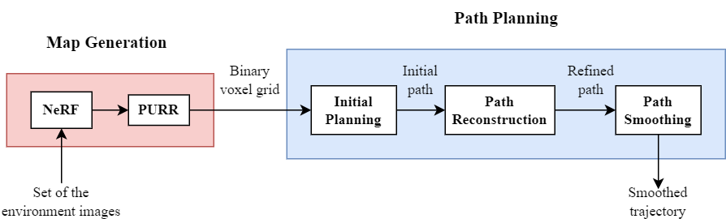

# Optimizing 3D Path Planning for UAVs in NeRF Environments: Path Reordering and Shortcut Node Strategy

This repository contains the implementation of our research paper: 

---

<!-- ## Abstract

This paper presents an autonomous navigation pipeline that leverages Neural Radiance Fields (NeRFs) to generate detailed environments for Unmanned Aerial Vehicle (UAV) path planning, bridging the gap between a novel 3D reconstruction technique and traditional pathfinding algorithms. We propose two novel algorithms, **Path Reordering** and **Shortcut Reconstruction**, as post-processing steps following the A* algorithm. These algorithms improve the efficiency of the initial path by reducing the number of turning points and the overall path length. **Path Reordering** reduces turning points by adjusting the transition order along the path, although it may have limitations in certain environments. **Shortcut Reconstruction** addresses the shortcomings of traditional Line-of-Sight (LoS) methods by introducing shortcut nodes between consecutive path segments that do not exist in the original path. This approach retains only the most significant nodes in the resulting path, improving the path length and reducing the worst-case computation time from *O(n²)* in the baseline to approximately *O(n)* in paths with many nodes. Additionally, applying LoS-based algorithms further enhances efficiency by checking the reachability of only the important nodes. Experimental results demonstrate the effectiveness of our approach in reducing both computation time and path complexity within NeRF-generated 3D environments. -->


## Overview

This project implements a 3D path planning pipeline that uses Neural Radiance Fields (NeRF) for map representation and introduces two post-processing algorithms for the planning process: **Path Reordering** and **Shortcut Reconstruction**. The pipeline consists of two main stages: Map Generation and Path Planning.

### Map Generation

A set of scene images is used to train a NeRF model, which is then used to generate a binary occupancy grid for path planning. For this step, we adopt the map reconstruction pipeline from the [CATNIPS](https://github.com/chengine/catnips) project.

### Path Planning

Given the binary grid and a pair of start and goal positions, we perform initial pathfinding using the A* algorithm. The resulting path is then refined using our proposed:

- **Path Reordering**, which adjusts the order of transitions to reduce unnecessary turning points.
- **Shortcut Reconstruction**, which adds efficient shortcut connections to improve path length.

The resulting path is further enhanced by applying Line-of-Sight (LoS)-based algorithms, followed by smoothing using the minimum snap trajectory generation.

<p align="center">
  
</p>

<p align="center">
  <strong>Overview of the proposed pipeline.</strong>
</p>

## Requirement
This project builds on top of [CATNIPS](https://github.com/chengine/catnips). If you can run it without issues, you should be able to run this project as well. We recommend setting up the environment as instructed in their repository.

## How to Run

### 1. Run the Pipeline

First, place the trained NeRF model in a folder, and manually specify the model path and configure the PURR settings inside the `main.py` script.

To execute the process (from converting the pre-trained NeRF model to performing path planning), run `main.py` either in VSCode or from the command line:

```bash
python main.py
```

### 2. Planning with an Existing Grid

If you already have a binary grid and want to run only the path planning step, you can directly use the planner module.  

First, initialize the planner with a 3D binary occupancy grid (`0` = free, `1` = obstacle) and the corresponding 3D points (map grid indices to 3D coordinates):

```python
from pipeline_scripts.Global_planner import *

planner = GlobalPlanner(occupancy_grid, grid_points)
```

Once the planner is initialized, you can generate an initial path using:

```python
init_path = planner.astar(start, goal)
```

> **Note:** The initial planner is a simple Python implementation intended for prototyping. If performance is a concern, consider replacing it with an existing optimized library.

To run the post-processing step, call the function below with the initial path, represented as a sequence of grid indices:

```python
post_path = planner.post_processing(init_path)
```

> **Note:** This function performs the full post-processing pipeline as described in the paper (Path Reordering → Shortcut Reconstruction → Parent Node Passing). You can also modify the process to run specific steps individually, skip certain steps, or change their order as needed.

To smooth the path, call the two lines below (the output is a set of 3D coordinates):

```python
path_points, upper, lower = planner.create_boundary(post_path, interpolate_path=True)

traj = planner.path_smothing(path_points, upper, lower, weight=100)
```

## Data

### 1. Scene Images  
The datasets used to train the NeRF models can be downloaded from the original repositories:  
- `stonehenge` from [nerf-nav](https://github.com/mikh3x4/nerf-navigation)  
- `statues` and `flightroom` from [CATNIPS](https://github.com/chengine/catnips)

### 2. Pre-trained NeRF Models  
The pre-trained NeRF models used in our experiments are available at the following link: [pre-trained model](https://drive.google.com/drive/u/2/folders/1qWIwqF--063DRQWf1CD6v-AOH9JG7DTN) 

These models were trained using the datasets mentioned above.

### 3. Experimental Results and Scripts  
The experimental results presented in the paper can be accessed from the following link:  [paper results](https://drive.google.com/drive/u/2/folders/1ApbqXD_9ccKynZ2Y1rK9urUC0lY_pa_M)  

To reproduce the graphs and figures in the paper, run the scripts provided in the `experiment_script` folder.
